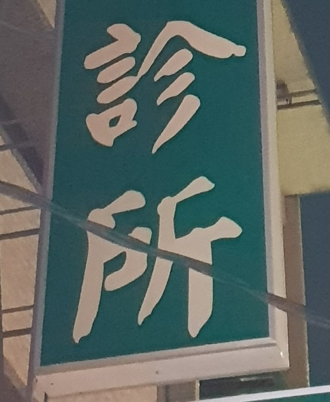
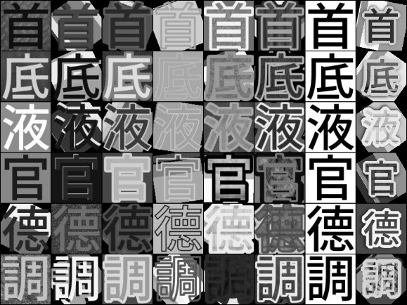
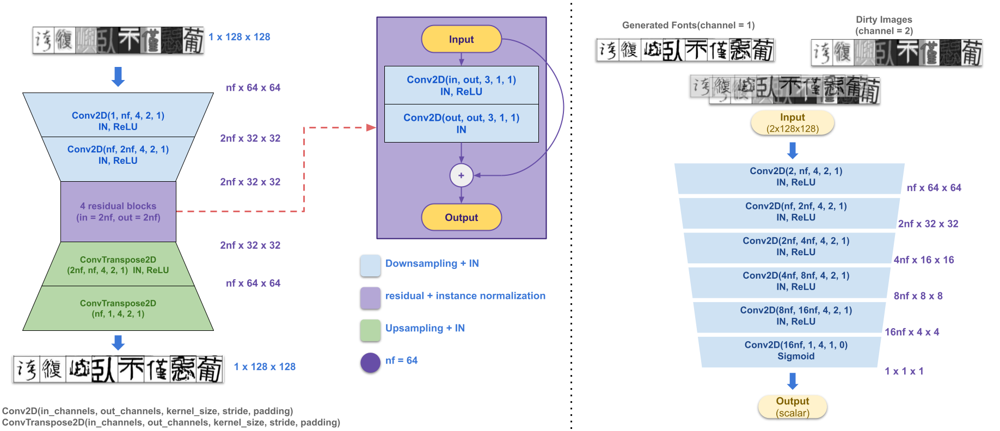

# Abstract
在人工智慧、深度學習蓬勃發展的時代，越來越多關鍵系統也跟著被開發出來，例如自動駕駛汽車、故障檢測、工廠自動化等越來越仰賴深度學習的技術，由於它們關鍵系統的性質，這些服務需要高度的可靠性、即時性與有效性。隨著各式各樣的種類需求被提出，野外場景中文文字識別仍然是一個極具有挑戰性的問題，例如某些部分的文字被其他物體與陰影遮擋住，或是由於光線反射及無法被拍攝出的角度等，如圖一。

 

圖一，圖片中文字被電線切斷

為此我們將提出透過結合深度學習技術與傳統方法來解決這些計算機視覺技術問題，並使其能夠
應用於場景中文字辨識。我們所提出的系統擁有以下優點
* 能夠應用於
所有場景文字辨識、為各大領域提供廣泛的用途。
* 能夠即時辨識，獲得
正確資訊。
* 在未來，我們的系統能夠搭配上資訊分析系統以利大量處理場景訊息來整理成各種有利情報，讓我們能夠對其做出決策。

我們所提出的架構包含了三個模組
* Detection Module 用 來 判 斷 文 字 之 位 置
* Cleaner Module 用來去除掉雜訊
* Recognition Module 用來辨識文字內容。

# Method
## Datasets
我們利用蒐集的街景中招牌的照片作為訓練及測試的資料集；除此之外，為了訓練 Cleaner，我們還使用了數種開源字體如 Noto Font、Taipei Sans TC 等，並自己利用 Qt 生成背景、材質、角度、大小來增加訓練資料數量使其能夠獲得很好的成果，如圖二，對於產生字體 dataset 的方式，我們使用了五種策略分別為隨機顏色、隨機材質圖片、水平線、垂直線、兩種顏色的漸層。最後再加上背景材質、3D 特效等，能夠模擬各式各樣的招牌字體與背景，能夠使我們訓練出來的模型更加符合實際情況。

 

圖二，自行產生之資料集

## PipeLine

我們系統的pipeline如圖所示，分為Detection Module、Cleaner Module、Recognition Module；首先我們會將圖片中的文字區塊會先利用Four-Points-Transform來轉換成正面文字圖片並利用YOLOv4來偵測出圖片中含有幾個字元；接著送至Cleaner Module來去除掉圖片中的雜訊，最後利用Recognition Network辨識出文字內容

 

圖三，整體流程圖

## Detection Module
由於文字區塊的角度可能不會全部都是矩形，Four-Points-Transform能夠協助我們將其轉換回矩形；接下來將利用YOLOv4來判斷句子內的所有文字若其超過一個字以上，最後我們將會獲得所有文字位置的資訊。(應用後則全使用YOLOv4檢測圖片中所有字元)

## Cleaner Module
Cleaner Module，其主要為生成對抗網路，是我們系統中用來去除雜訊的架構，如圖所展示，左邊為generator右邊為discriminator，我們的目標是希望generator能將具有雜訊例如陰影、樹枝、電線遮掩的文字圖片，生成出清晰的白底黑字文字圖片，如此一來能夠提高辨識準確度，其架構參考了Cycle GAN，由Downsampling、Residual、Upsampling Blocks所構成，如圖四所展示。 

 

圖四，Cleaner 架構

## Recognition Module
最後這個區塊將會預測文字，我們使用了三種架構來做測試比較，第一種為一般的神經網路，只由convolutional和fully connected layers組成，收斂雖然最快但準確度卻是最低，第二種為擁有Feature Extractor的神經網路，利用5個ConvBlocks來對圖片進行down sampling，再接上fully connected layers來進行判斷，收斂雖然慢但準確度卻是提高了不少。第三種為ResNet152，雖然訓練速度下降許多，但準確度則是三者之中表現最好的。；用來判斷我們精心挑選常用的6000中文字。

# Experiment

 

圖五，Cleaner Module 輸出結果，由上而下分別為(1) dirty image (2) cleaner output (3) ground truth

 

圖五，系統輸出

 
 
 

# Prerequisites
## Install Dependencies
* python >= 3.8
* [python-opencv](https://pypi.org/project/opencv-python/)
* [numpy](https://numpy.org/)
* [pytorch](https://pytorch.org/get-started/locally/) >= 1.9
* [pillow](https://pillow.readthedocs.io/en/stable/installation.html)
* [albumentations](https://github.com/albumentations-team/albumentations)
* [pyqt5](https://pypi.org/project/PyQt5/)
* [tqdm](https://github.com/tqdm/tqdm)

# Asset sources
## Fonts
### Cleaner
* [Noto Fonts CJK](https://www.google.com/get/noto/help/cjk/)
* [清松手寫體](https://www.facebook.com/groups/549661292148791/)
* [jf open 粉圓字型](https://justfont.com/huninn/)
* [台北黑體](https://sites.google.com/view/jtfoundry/zh-tw)
* [全字庫正楷體](https://data.gov.tw/dataset/5961)
* [全字庫正宋體](https://data.gov.tw/dataset/5961)
* [源泉圓體](https://github.com/ButTaiwan/gensen-font)
### Recognizer
* [chinesefontdesign.com](https://chinesefontdesign.com/)
## Textures
* [opengameart.org](https://opengameart.org/textures/)
